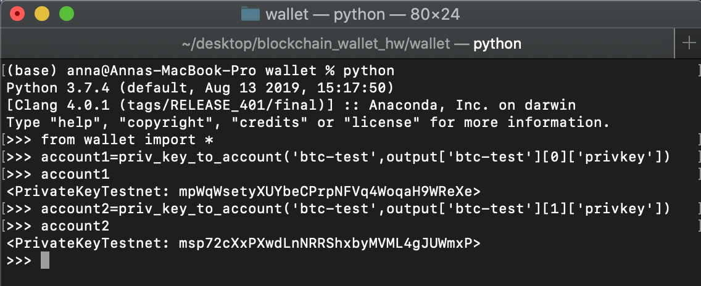

# blockchain_wallet_hw

In this process we used hd-wallet-derive tool to make unique wallet addresses from a BIP 39 mnemonic phrase using the derive wallets aspect of hd-wallet-derive. The wallet address and keys were then used to send test transactions for both bitcoin and ethereum using available python libraries [bit](https://ofek.dev/bit/) (for bitcion functions) and [web3](https://web3py.readthedocs.io/en/latest/) (for ethereum functions).

# Getting HD-WALLET-DERIVE
The first process was cloning the hd-wallet-derive repository to the directory where the wallets would be made. The following commands were run in terminal to complete the hd-wallet-derive install.

*git clone https://github.com/dan-da/hd-wallet-derive*
*cd hd-wallet-derive*
*php -r "readfile('https://getcomposer.org/installer');" | php*
*php -d pcre.jit=0 composer.phar install*

Using the following command in terminal a sym link was made to directly call the wallet derive function with *./derive* instead of a longer *./hd-wallet-derive/hd-wallet derive.php*.

*ln -s hd-wallet-derive/hd-wallet-derive.php derive*

The results from hd-wallet-derive will appear in a format as can be seen in the output file and the following image. Multiple addresses with private and public keys will be compiled for the BIP39 mnemonic used in the subprocess commans of the wallet python file.

# What Does the Wallet Do?
The wallet that has been created is designed to send and receive crypto currency transactions. It has a BIP39 mnemonic pass phrase that is original to its seed. Using the hd-wallet-derive tools, the wallet was created and it was given an unique address for which a public and private key are provided. The public key or address is what is shared on the network for the wallet to send or recieve a transaction. The private key is what is used to digitally sign and confirm the transaction can be sent from the wallet when sending.

# Sending Test Transactions

### BTC Test Transaction

* Fund Account 1

Before sending a transaction, the test wallet address need to be prefunded. 
To do this a [btc-test faucet](https://testnet-faucet.mempool.co/) was used to get testnet coins. Then another site link was used to view the balance of the account and transactions occuring on the testnet blockchain.
Here is an example of getting coins from the testnet faucet. It can be seen that the transaction to fund the btc_account1 was sent. The btc_account1 was prefunded with 0.001 BTC from the faucet.

Then it can be viewed on the blockchain that the btc_account1 now has funds available on the testnet. 

* Send a Transaction from Account 1 to Account 2

In order to send tranactions the wallet.py function file needs to be called within the wallet folder.
In a terminal the following commands can be run.
First the entire content of the wallet.py file must be imported to the python interface in the terminal. 
Then the priv_key_to_account function which gives the account object and information with in the bit library can be pulled from the privkey output obtained from hd-wallet-derive using a mnemonic phrase.
Here we can see both btc_account1 and btc_account2 being defined as an example.

Then the send_tx function must be called referencing account1 and account2 in order to create, sign and send a transaction. Below is an example of what a raw transaction looks like before being signed. 

This is an output of bit.PrivateKeyTestnet.prepare_transaction().

Here is what a full process of running the functions from wallet.py looks like to send a transaction. As shown, the transaction that was sent as a test was sent for the btc-test coin sent from account1 to account2 for a value of 0.0005 BTC.

When the function finishes processing there will be no out put in the terminal. Once the new line is showin in the terminal. Open up the [block explorer site](https://tbtc.bitaps.com/)
which allows you to view the balance and transactions of the bitcoin testnet. The following images show the transaction was sucessefully sent from the address associated with btc_account1 and that it was sucessfully recieved by btc_account2.

### ETH Test Transaction

* Fund Account 1
Fund the first eth_account1 either by setting up a new testnet using geth and including it in the accounts to prefund or by sending funds from an account on an existing testnet. Once you can see you have funds in the eth_account1 you are ready to send from that account.

If adding an address to an existing testnet json file it will look like this, add 1 address along with the 2 node addresses.

If using existing testnet. The nodes must also be reinitialized with the updated .json information.

* Send a transaction for getting gas set. 

For ethereum ot get the gas function to work properly send a transactino between the testnet nodes or to the eth_account1 to get it initialized. 

* Send a Transaction from Account 1 to Account 2

In order to send tranactions the wallet.py function file needs to be called within the wallet folder.
In a terminal the following commands can be run.
First the entire content of the wallet.py file must be imported to the python interface in the terminal. 
Then to send a transaction call the send_tx function and input ethereum as the coin, and eth_account1 and eth_account 2. We can see here a transaction set for 3 ETH.

The output showing is a hex code for the txid (transaction id). This transaction id can be put into mycrypto as follows to check the transaction.

Here we can see the transaction was sent to the testnet and sent properly from eth_account1 address to eth_account 2 address for 3 ETH (although this is shown in wei here).

